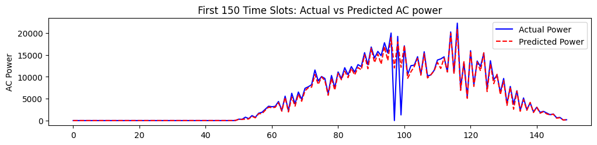

# Solar Power Generation Forecasting

## Overview
This project develops a **machine learning model to predict AC power output** for solar power plants. As the world transitions toward renewable energy, **accurate solar forecasting** is critical for managing the intermittency of solar generation. Reliable predictions help operators balance electrical loads, reduce mismatches between supply and demand, and improve overall grid efficiency. This project demonstrates how to **standardize and manage disparate datasets** to enable effective AI-driven forecasting.

## Dataset
Data(from kaggle) was collected from **two solar plants over 34 days** (May 15 – June 17, 2020), including:

- **Generation Data:** `DC_POWER`, `AC_POWER`, `DAILY_YIELD`, `TOTAL_YIELD` from 44 inverters.
- **Sensor Data:** Environmental conditions such as `AMBIENT_TEMPERATURE`, `MODULE_TEMPERATURE`, and `IRRADIATION`.
- **Scale:** 136,476 entries.

## Tech Stack
- **Language:** Python  
- **Libraries:** Pandas, Scikit-learn, Matplotlib, Seaborn  
- **Model:** RandomForestRegressor  

## Project Pipeline

### 1. Data Loading & Cleaning
- **Integration:** Combined generation and sensor datasets for both plants.  
- **Aggregation:** Summed generation data by `DATE_TIME` and `PLANT_ID`.  
- **Merging:** Joined generation and sensor data on timestamps and plant IDs.

### 2. Preprocessing & Feature Engineering
- **Temporal Features:** Extracted `hour` and `day` from timestamps to capture daily cycles.  
- **Categorical Encoding:** Transformed `PLANT_ID` using **OneHotEncoder**.  
- **Correlation Analysis:** Found a **0.94 correlation** between **Irradiation** and `AC_POWER`.

### 3. Modeling Strategy
- **Chronological Split:** Maintained time-series integrity by using the first **80% of the timeline** (up to June 11) for training and the remaining 20% for testing.  
- **Features:** `AMBIENT_TEMPERATURE`, `MODULE_TEMPERATURE`, `IRRADIATION`, `hour`, and encoded plant IDs.

## Results
**RandomForestRegressor** (100 estimators) achieved:

- **R² Score:** 0.9658  
- **Mean Absolute Error (MAE):** 450.12  

### Key Insight: The "Power Driver"
Feature importance analysis shows that **Irradiation** is the dominant factor in predicting solar power output, followed by **module** and **ambient temperatures**.

---

